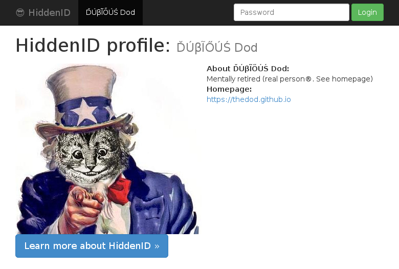

### stakehouse-default HiddenID theme

Exactly like the default theme, only with
[stake house](https://github.com/hidden-id/stakehouse#readme) support.

### Recognized `sstore/profile.json` fields:

* **nickname:** Can contain UTF-8 characters.
* **description:** Optional. Plain text. Use `\"` for `"`, and `\n` for new line.
* **avatar:** Optional URL of a 300-400px wide image. Best is to put the image at
  the id's `sstore/static/img/` (accessible as `/static/img/` by the HiddenID server).
* **homepage:** Optional URL.
* **stakes:** Optional. A list of `["url1",...]`. The profile will contain a
  [strong stake claim](https://github.com/hidden-id/stakehouse/wiki/Stake-House%3A-Certification-without-authority#strong-stake-claims)
for each (a `<link/>` in the `<head/>`).
* **homepage-is-stake:** Obsolete. Homepage link will have a `rel="stake"`. Not really useful since it's better to add your hompage to **stakes**.
  It's only needed for historical reasons (an [example](https://github.com/hidden-id/stakehouse/wiki/Stake-House%3A-Certification-without-authority#pretty-strong-stake-claims) in the wiki).
